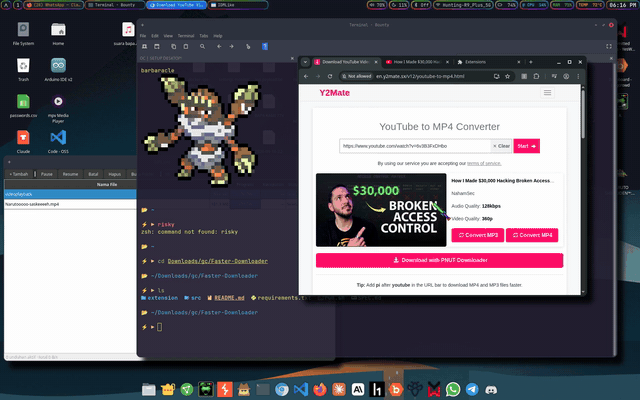

<div align="center">
<a href="https://ibb.co.com/mnFfKs3"></a>
</div>


# IDMLike

Download manager gratis ala IDM: cepat (multi-koneksi), bisa lanjut tanpa putus (resume),
dan otomatis menangkap download dari browser Chromium.

- **Engine:** `aria2c` (RPC, port 6800) — sudah terpasang di sistem.
- **GUI:** PySide6 (Qt).
- **Browser capture:** extension Chromium MV3 + server lokal `127.0.0.1:20129`.

## Demo



## Cara menjalankan

```bash
~/tools/idmlike/run.sh
```

Pertama kali dijalankan, script otomatis membuat venv dan menginstal dependensi
(`PySide6`, `aiohttp`) ke `~/tools/idmlike/.venv`.

Alternatif: buka menu aplikasi → cari **"IDMLike"** (desktop entry sudah terpasang di
`~/.local/share/applications/idmlike.desktop`).

## Fitur

| Aksi | Cara |
|---|---|
| Tambah unduhan | Tombol **+ Tambah** (Ctrl+N), masukkan URL |
| Pause | Pilih baris → **Pause** |
| Resume | Pilih baris → **Resume** |
| Batal | Pilih baris → **Batal** |
| Hapus dari daftar | Pilih baris → **Hapus** |
| Buka folder file | Klik dua kali baris, atau tombol **Buka Folder** |
| Jumlah koneksi paralel | Spinbox di toolbar (1–16, default 16) |

## Auto-capture dari browser

1. Jalankan IDMLike (biarkan terbuka).
2. Buka `chrome://extensions` (Chromium/Chrome).
3. Aktifkan **Developer mode** (pojok kanan atas).
4. Klik **Load unpacked** → pilih folder `~/tools/idmlike/extension`.
5. Download apa pun di browser kini otomatis dialihkan ke IDMLike.

Cara kerja: saat browser memulai download, extension membatalkannya lalu mengirim URL
ke server lokal IDMLike; jika IDMLike tidak berjalan, extension membiarkan download
browser berjalan normal.

Untuk menonaktifkan pengalihan sementara: set `capture_enabled` ke `false` di
`chrome.storage.session` (devtools service worker extension), atau cukup nonaktifkan
extension-nya. Default: aktif.

## Struktur

```
~/tools/idmlike/
├── run.sh                    launcher
├── requirements.txt          dependensi Python
├── SPEC.md                   kontrak antar-modul
├── extension/                extension Chromium (manifest + background)
│   ├── manifest.json
│   └── background.js
└── src/idmlike/
    ├── app.py                GUI PySide6 (MainWindow, AddDialog)
    ├── capture_server.py     server HTTP 127.0.0.1:20129 (aiohttp)
    ├── config.py             konfigurasi (~/.config/idmlike/config.json)
    └── engine.py             wrapper RPC aria2c
```

## Konfigurasi

File: `~/.config/idmlike/config.json` (dibuat otomatis saat pertama kali disimpan).

| Kunci | Default | Keterangan |
|---|---|---|
| `download_dir` | `~/Downloads` | Folder tujuan unduhan |
| `max_connections` | 16 | Koneksi paralel per unduhan |

## Catatan teknis

- Port: aria2 RPC `127.0.0.1:6800` (secret token `idmlike`, hanya diekspos di loopback),
  capture server `127.0.0.1:20129`.
- Backup dengan timestamp tidak pernah dihapus otomatis.
- Semua data lokal; tidak ada layanan eksternal.
